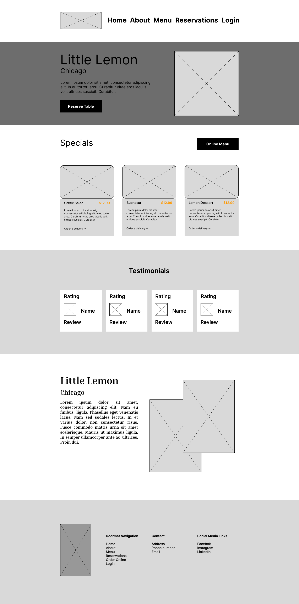
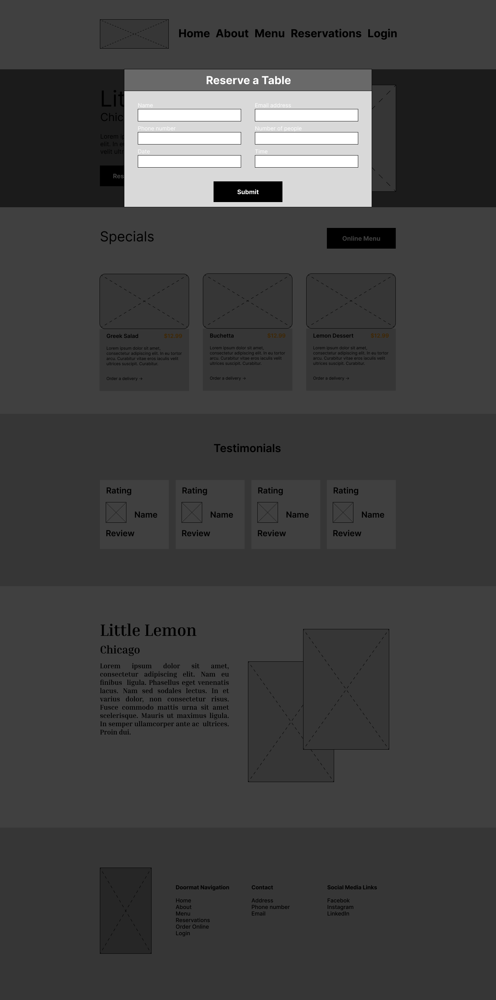
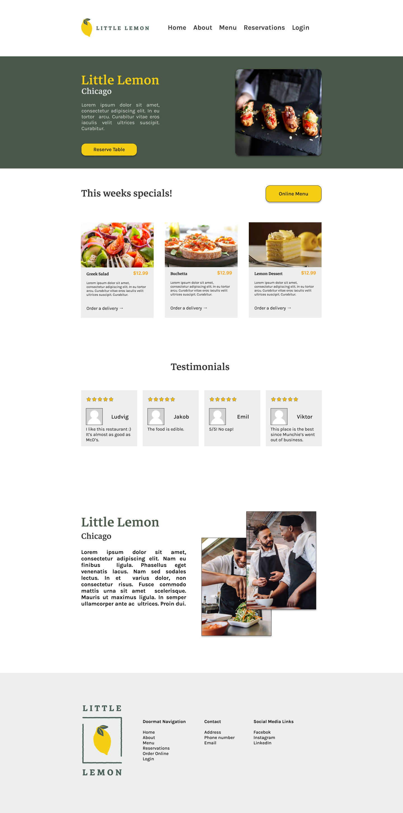
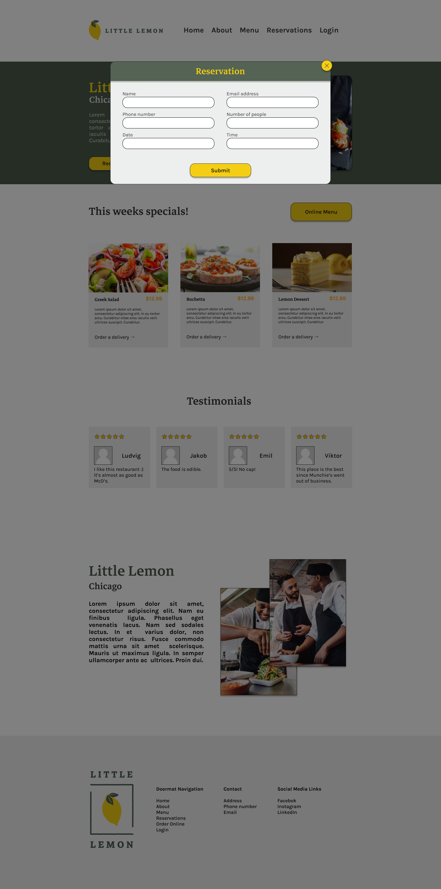

# Little Lemon -- React
> [!NOTE]
> Project under development

## Table of Content

- [Introduction](#introduction)
- [Wireframe](#wireframe)
- [Prototype](#prototype)
- [Live Demo](#live-demo)
- [Installation](#installation)

## Introduction

This is my Capstone project for Meta Front-End Developer Professional Certificate; a Coursera specialization by Meta.
The primary tasks are to create a wireframe for the web app in Figma, then move on to making a prototype in Figma, then lastly to create the web app in React and make sure that the "reserve a table" function works.

## Wireframe

[See Figma Project](https://www.figma.com/file/rMigo5sfb9XEgWB9X1QGeJ/Capstone-project?type=design&node-id=0%3A1&mode=design&t=6ZzyyeuhaVgxAmig-1)

Show Wireframe 1

 

Show Wireframe 2

## Prototype

[See Figma Project](https://www.figma.com/file/rMigo5sfb9XEgWB9X1QGeJ/Capstone-project?type=design&node-id=51%3A169&mode=design&t=gdwTriMun9hFfETd-1)

Show Prototype 1

 

Show Prototype 2

## Live Demo

[See live demo!](https://ludvigalmvaang.github.io/little-lemon-react/)

## Installation

- Clone the repository
- Run `npm install`
- Run `npm run dev`